# agentd — Design Doc

- **Date**: 2026-05-29
- **Status**: Draft (pending spec-document-reviewer + user approval)
- **Audience**: Implementers (Rust), Reviewers, integrators of mempal / agent-spec / Robrix
- **Scope**: A Rust replacement for agent-chat that fuses (a) octos-tui's clean trait-first architecture, (b) attractor's DOT-based workflow engine, (c) mempal's memory + cowork-bus, and (d) agent-spec's task contracts — all addressable through a Matrix-native chat surface (Robrix) plus an ops dashboard.

---

## 0. Executive Summary

**Problem**: agent-chat (Node) is a working multi-agent coordinator but it conflates tmux with identity, has no formal workflow layer, hardcodes adversarial-review semantics, and tangles operational state with semantic memory. A Rust rewrite gives us the chance to fix the architectural boundaries while standing on three already-built systems (mempal, agent-spec, Robrix).

**Solution**: A single Rust daemon (`agentd`) that:

1. Runs `.agentflow/*.dot` workflows (attractor-shaped: Parse→Transform→Validate→Initialize→Execute→Finalize) with built-in handlers `codergen` / `wait.human` / `conditional` / `parallel.fan_out` / `parallel.fan_in` / `tool` / `stack.manager_loop`.
2. Spawns and drives agent processes through an `AgentBackend` trait; v0 ships `TmuxBackend` only, using octos-tui's safe buffer-path prompt injection.
3. Persists operational state in its own SQLite (`~/.agentd/agentd.db`); never writes to mempal's `palace.db`. Talks to mempal exclusively through its MCP server.
4. Bridges a Matrix room per project (Robrix is the primary client) into the workflow engine via typed slash commands; routes inter-agent messages through mempal cowork-bus, not its own bus.
5. Mirrors GitHub Issues as the source of truth for work intake; integrates `agent-spec` for spec / plan / lifecycle / guard as workflow `tool` nodes.

**Non-goals**: own memory system, own message bus, own IM protocol, own LLM SDK, multi-tenant SaaS, Windows native, distributed multi-host (v0).

**MVP success**: An operator types `/run start <issue>` in a Robrix room, a 4-agent team (spec-writer / planner / implementer / 2 adversarial reviewers) walks issue → spec → plan → impl → review → PR, and `kill -9` of the daemon resumes cleanly from checkpoint. Estimated effort ≈ 1320 agent-rounds across 10 P0 phases.

---

## 1. Architecture

### 1.1 Topology

```
┌─────────────────────────────────────────────────────────────┐
│ agentd  (binary, tokio + axum + sqlx + rmcp client)           │
│                                                                │
│  Workflow Engine (attractor-shaped, DOT files)                 │
│      Parse→Transform→Validate→Initialize→Execute→Finalize     │
│      handlers: codergen/wait.human/conditional/                │
│                parallel.fan_out/parallel.fan_in/tool/          │
│                stack.manager_loop                              │
│      goal_gate · retry · per-node checkpoint                   │
│                                                                │
│  AgentBackend trait → TmuxBackend(v0)  [spawn/drive only]      │
│  Adapters: GitHub · Matrix · MempalClient · EventBus           │
│  Surfaces: HTTP+SSE (axum) · MCP Server (rmcp)                 │
└─────────────────────────────────────────────────────────────┘
        │ MCP client                       │ HTTP/SSE
        ▼                                  ▼
┌─────────────────────────────┐    ┌──────────────────┐
│ mempal  (binary, palace.db) │    │ Robrix / dashboard│
│   search · ingest · kg ·    │    │ / agentctl        │
│   fact-check · cowork-bus · │    └──────────────────┘
│   diary · AAAK              │
└─────────────────────────────┘
```

### 1.2 Crate Layout

```
agentd/
├── crates/
│   ├── agentd-core/     # domain types, workflow engine (no I/O)
│   ├── agentd-tmux/     # TmuxBackend impl + buffer prompt path
│   ├── agentd-store/    # ~/.agentd/agentd.db via sqlx
│   ├── agentd-mempal/   # rmcp client wrapper for palace.db
│   ├── agentd-github/   # octocrab + webhook handler
│   ├── agentd-matrix/   # matrix-sdk + cowork-bus gateway
│   ├── agentd-surface/  # axum HTTP+SSE + rmcp server
│   └── agentd-bin/      # main(), wires everything
├── crates/agentctl/     # CLI client
├── workflows/           # shipped .dot templates
└── specs/               # agent-spec contracts for agentd itself
```

Single binary, single SQLite file, single process. Rust edition 2024. `tokio = "1.49"`.

### 1.3 Subsystem Responsibilities

| Subsystem        | Owns                                              | Does NOT do                       |
| ---------------- | ------------------------------------------------- | --------------------------------- |
| Workflow Engine  | DOT parse, node execution, checkpoint, goal_gate  | call tmux/matrix/github directly  |
| AgentBackend     | spawn / send_prompt / capture / interrupt / kill  | know workflows exist              |
| Store            | persist + query + migrate                         | initiate business actions         |
| GitHub Adapter   | issue pull/push, PR, webhook                      | write any other external system   |
| Matrix Adapter   | room/MXID/event bidirectional, slash router       | parse workflows                   |
| MempalClient     | rmcp calls to mempal, outbox drainer              | embed mempal logic                |
| EventBus         | single broadcast channel for all internal events  | persist (Store does)              |
| HTTP+SSE         | Dashboard, agentctl, Robrix front-end             | accept agent process connections  |
| MCP Server       | exposes tools to agent processes (claude/codex)   | direct SQL                        |

### 1.4 Why daemon + thin clients (instead of TUI-first)

- The user-facing UI is **Robrix** (Matrix client built on Makepad) plus an ops **Dashboard**. Both are thin clients.
- A single daemon means: one place for state, one event bus, one workflow engine, no double-write.
- This rules out a monolithic TUI like octos-tui, while preserving the option to add one later as just another client.

---

## 2. Workflow Model

### 2.1 File Layout (per project repo)

```
<project-repo>/.agentflow/
├── issue-to-pr.dot          ← default canonical pipeline
├── spec-only.dot
├── adversarial-review.dot
└── lib/
    └── nodes.dot            ← optional shared subgraph
```

If `.agentflow/` is missing in a project, daemon falls back to its built-in copy shipped under `workflows/`.

### 2.2 Node Attribute Schema (DOT)

| Attribute       | Type                                | Meaning                                                                                                |
| --------------- | ----------------------------------- | ------------------------------------------------------------------------------------------------------ |
| `shape`         | `Mdiamond` / `Msquare` / `box`      | start / terminal / regular                                                                             |
| `handler`       | `codergen` / `wait.human` / ...     | node kind (attractor's eight)                                                                          |
| `role`          | string                              | resolves to an agent MXID                                                                              |
| `backend`       | `tmux` (v0)                         | AgentBackend selection                                                                                 |
| `worktree`      | `auto` / `<name>` / `inherit`       | whether to create a fresh git worktree                                                                 |
| `pre_tools`     | comma-list                          | mempal calls daemon performs **before** node runs; results injected into initial prompt                |
| `post_action`   | comma-list                          | actions taken **after** node completes (mempal_ingest, mempal_kg add, matrix.post, github.status_push) |
| `goal_gate`     | bool                                | terminal nodes can't exit until all `goal_gate=true` nodes have SUCCESS                                |
| `retry_policy`  | `max=N,backoff=...,jitter=...`      | per-node retry                                                                                         |
| `timeout_secs`  | int                                 | per-execution cap                                                                                      |
| `aggregator`    | `any_fail` / `majority_pass` / ...  | fan_in only                                                                                            |
| `visibility`    | `blind` / `after_submit` / `chain`  | fan_out only — reviewer cross-visibility                                                               |
| `bundle`        | `frozen` / `live`                   | fan_out only — context freezing policy                                                                 |
| `condition`     | bool expr                           | edge attribute (attractor-style)                                                                       |

### 2.3 Outcome Model

```rust
pub enum Status { Success, Fail, Retry, PartialSuccess }

pub struct Outcome {
    pub status: Status,
    pub preferred_label: Option<String>,
    pub suggested_next_ids: Vec<NodeId>,
    pub context_updates: serde_json::Map,
    pub artifacts: Vec<Artifact>,
    pub mempal_writes: Vec<MempalWrite>,
}
```

After each node: one row in `node_outcomes`, one checkpoint write, one event broadcast.

### 2.4 Edge Selection (inherits attractor)

1. Edges with `condition=` matched first (boolean expressions)
2. Handler's `preferred_label`
3. Handler's `suggested_next_ids`
4. Among remaining unconditional edges, highest `weight` wins
5. Lexical node-id tiebreak

### 2.5 ReviewBundle Materialization (fan_out specific)

When a `parallel.fan_out handler` runs:

1. Freeze context: collect issue/spec/plan/diff/transcript from store, write `~/.agentd/reviews/<id>/context/`, build MANIFEST, compute `context_sha = sha256(MANIFEST.toml)`.
2. Per-reviewer stance pack: for each reviewer, run a distinct `mempal_search` (different query in node attribute) → write `per_reviewer/<reviewer>/context-pack.md`.
3. Spawn N reviewer sessions via TmuxBackend; each gets its own worktree pwd and env carrying `AGENTD_REVIEW_ID` + `MEMPAL_CONTEXT_PACK`.
4. Reviewers submit verdicts via agentd MCP server → `review_verdicts` table.
5. fan_in node runs `aggregator`, emits Outcome.

Bundle is **frozen** (same `context_sha` for all reviewers); stance packs are **per-reviewer deliberately diverse** (this preserves adversarial multi-perspective without redundancy).

### 2.6 Spec Generation Sub-graph (human-in-loop)

Spec generation is iterative dialogue, not one-shot. Sub-graph:

```dot
"propose_spec"      [handler="codergen", role="spec-writer", ...]
"lint_spec"         [handler="tool", cmd="agent-spec lint $artifact --min-score 0.7 --format json"]
"human_review_spec" [handler="wait.human", interviewer="matrix:room=$project_room",
                     prompt="Spec draft v{rev} ready. /spec-approve | /spec-changes <feedback> | /spec-abandon",
                     options="approve,changes,abandon", timeout_hours=72]
"revise_spec"       [handler="codergen", role="spec-writer", context_carry="previous_draft,human_feedback,lint_findings"]
"finalize_spec"     [handler="tool",
                     cmd="git -C $repo add specs/issue-${issue_id}.spec.md && git -C $repo commit -m '...'",
                     post_action="mempal_ingest(importance=5,kind='spec')"]
```

Edges:

- `propose_spec` → `lint_spec`
- `lint_spec` → `human_review_spec` if outcome=success; `revise_spec` if outcome=fail
- `human_review_spec` → `finalize_spec` if answer=approve; `revise_spec` if answer=changes; `abandoned` if answer=abandon
- `revise_spec` → `lint_spec`

Drafts live at `~/.agentd/runs/<id>/specs/draft-v<N>.spec.md`. Only `finalize_spec` writes to project's git `specs/issue-NNN.spec.md`.

### 2.7 Validation Pipeline

`agentctl flow validate <path.dot>` checks:

- ≥ 1 start (`shape=Mdiamond`), ≥ 1 terminal (`shape=Msquare`)
- all `handler`s registered
- all `role`s exist in agent registry
- all `pre_tools` / `post_action` reference legal MCP tools
- every `goal_gate=true` node is covered by some path
- DAG has no unreachable nodes
- `parallel.fan_in` in-edges ≤ paired fan_out out-edges
- worktree references consistent

CI runs this gate against all shipped DOTs.

### 2.8 Shipped DOT Templates

- `issue-to-pr.dot` — full issue → spec → plan → impl → review → PR
- `spec-only.dot` — stop at spec finalized
- `adversarial-review.dot` — input is an existing PR/branch, only run fan_out review

---

## 3. Data Model

### 3.1 Data Ownership Map

| Data                                  | Source of truth                     | Mirror / cache                                              | Writer                                          | Notes                                              |
| ------------------------------------- | ----------------------------------- | ----------------------------------------------------------- | ----------------------------------------------- | -------------------------------------------------- |
| Issue title/body/labels               | GitHub                              | `agentd.db.issues`                                          | agentd-github (one-way pull, state push back)   | octocrab + webhook                                 |
| Workflow run state                    | `agentd.db`                         | —                                                           | agentd-core                                     | never in mempal                                    |
| Node Outcome / Checkpoint             | `agentd.db` + `checkpoint.json`     | —                                                           | agentd-core                                     | file is disaster recovery, DB is query             |
| Spec draft (unapproved)               | `~/.agentd/runs/<id>/specs/`        | `agentd.db.artifacts`                                       | spec-writer                                     | not in git, not in mempal                          |
| Spec finalized (approved)             | git repo `specs/issue-N.spec.md`    | mempal drawer (`kind=spec, importance=5`)                   | agentd `finalize_spec` node                     | git wins on conflict                               |
| Plan                                  | git repo `docs/plans/` (optional)   | mempal drawer (importance=4)                                | agentd `draft_plan` node                        |                                                    |
| Diff                                  | git commit in worktree branch       | `agentd.db.task_runs.diff_sha`                              | implementer                                     | only pointer stored                                |
| Transcript                            | `~/.agentd/runs/<id>/transcript`    | mempal drawer (importance=2, chunked)                       | agentd capture                                  |                                                    |
| ReviewBundle                          | `~/.agentd/reviews/<id>/` (frozen)  | `agentd.db.review_runs.bundle_sha`                          | agentd review fan_out                           | content-addressed                                  |
| Review verdict                        | `agentd.db.review_verdicts` + dir   | mempal KG triple `<review_id> has_verdict <result>`         | reviewer (via MCP)                              | DB structured, mempal semantic                     |
| Agent registry (MXID/role/backend)    | `agentd.db.agents`                  | mempal cowork-bus `agents.json`                             | agentd at startup pushes to mempal              | agentd is source                                   |
| Inter-agent messages                  | mempal cowork-bus                   | —                                                           | mempal p84                                      | agentd never stores                                |
| Matrix events (workflow-relevant)     | Matrix homeserver                   | `agentd.db.matrix_events` (filtered)                        | matrix-sdk                                      | not a full mirror                                  |
| Agent diary                           | mempal `wing=agent-diary`           | —                                                           | reviewer / implementer agents                   | agentd doesn't index                               |
| KG triples                            | mempal `palace.db`                  | —                                                           | mempal                                          | agentd writes via `mempal_kg add`                  |

**Rule of thumb**: agentd never `INSERT` into `palace.db`; mempal never `INSERT` into `agentd.db`. MCP is the only channel.

### 3.2 Filesystem Layout

```
~/.agentd/
├── config.toml
├── agentd.db                      # main DB
├── agentd.db-wal / -shm
├── runs/<run_id>/
│   ├── checkpoint.json
│   ├── context.json
│   ├── outcomes/<node_id>.json
│   ├── specs/draft-v<N>.spec.md
│   ├── plan.md
│   ├── transcript.jsonl
│   └── verification/
├── reviews/<review_id>/           # immutable
│   ├── MANIFEST.toml              # sha256 of every file
│   ├── context/{issue,spec,plan,diff,transcript,repo→symlink}
│   ├── per_reviewer/<mxid>/context-pack.md
│   └── verdicts/<mxid>.json
├── worktrees/<project>/<task_run_id>/
├── logs/
└── tmp/
```

Retention: `runs/<id>/` 14 days active → tar.zst archive 14-90d → delete after 90d. `reviews/<id>/` permanent. Background `prune` task.

### 3.3 `agentd.db` Schema (v1, abbreviated DDL)

14 tables. Migrations live in `crates/agentd-store/migrations/`, applied at startup.

```sql
-- projects
CREATE TABLE projects (
    id TEXT PRIMARY KEY, name TEXT NOT NULL UNIQUE,
    repo_path TEXT NOT NULL, github_repo TEXT, matrix_room_id TEXT,
    mempal_wing TEXT NOT NULL, agentflow_dir TEXT NOT NULL DEFAULT '.agentflow',
    created_at INTEGER NOT NULL, updated_at INTEGER NOT NULL
);

-- agents
CREATE TABLE agents (
    id TEXT PRIMARY KEY,                  -- e.g. "claude-impl-a"
    mxid TEXT NOT NULL UNIQUE,
    role TEXT NOT NULL,                   -- spec-writer|planner|implementer|reviewer
    backend TEXT NOT NULL,                -- "tmux" (v0)
    backend_target TEXT,
    prompt_profile TEXT,
    enabled INTEGER NOT NULL DEFAULT 1,
    created_at INTEGER NOT NULL
);

CREATE TABLE project_agents (
    project_id TEXT NOT NULL REFERENCES projects(id),
    agent_id TEXT NOT NULL REFERENCES agents(id),
    invited_at INTEGER NOT NULL,
    PRIMARY KEY (project_id, agent_id)
);

-- issues (mirror of GitHub admitted to a workflow)
CREATE TABLE issues (
    id TEXT PRIMARY KEY,                  -- "<project>:<gh#>"
    project_id TEXT NOT NULL REFERENCES projects(id),
    github_number INTEGER NOT NULL,
    title TEXT NOT NULL, body TEXT NOT NULL,
    labels TEXT NOT NULL,                 -- JSON
    state TEXT NOT NULL,
    workflow_dot TEXT,
    fetched_at INTEGER NOT NULL,
    UNIQUE (project_id, github_number)
);

-- workflow runs
CREATE TABLE runs (
    id TEXT PRIMARY KEY,
    project_id TEXT NOT NULL REFERENCES projects(id),
    issue_id TEXT REFERENCES issues(id),
    workflow_path TEXT NOT NULL,
    workflow_sha TEXT NOT NULL,           -- sha of .dot file at start
    status TEXT NOT NULL,                 -- pending|running|blocked|succeeded|failed|abandoned
    started_at INTEGER NOT NULL,
    finished_at INTEGER,
    last_heartbeat INTEGER NOT NULL,
    current_node TEXT
);
CREATE INDEX idx_runs_status_heartbeat ON runs(status, last_heartbeat);

-- node outcomes (append-only)
CREATE TABLE node_outcomes (
    run_id TEXT NOT NULL REFERENCES runs(id),
    node_id TEXT NOT NULL, attempt INTEGER NOT NULL,
    status TEXT NOT NULL,
    preferred_label TEXT, suggested_next TEXT,
    context_delta TEXT NOT NULL,
    artifacts TEXT NOT NULL,
    started_at INTEGER NOT NULL, finished_at INTEGER NOT NULL,
    error_kind TEXT, error_detail TEXT,
    PRIMARY KEY (run_id, node_id, attempt)
);

-- artifacts (content-addressed pointers)
CREATE TABLE artifacts (
    sha256 TEXT PRIMARY KEY,
    kind TEXT NOT NULL,                   -- spec|plan|diff|transcript|verdict|context-pack
    path TEXT NOT NULL, bytes INTEGER NOT NULL,
    created_at INTEGER NOT NULL,
    run_id TEXT, node_id TEXT
);

-- task_runs (one per implementer invocation)
CREATE TABLE task_runs (
    id TEXT PRIMARY KEY,
    run_id TEXT NOT NULL REFERENCES runs(id),
    node_id TEXT NOT NULL,
    agent_id TEXT NOT NULL REFERENCES agents(id),
    worktree_path TEXT NOT NULL,
    base_commit TEXT NOT NULL, head_commit TEXT,
    diff_sha256 TEXT REFERENCES artifacts(sha256),
    transcript_sha256 TEXT REFERENCES artifacts(sha256),
    status TEXT NOT NULL,
    started_at INTEGER NOT NULL, finished_at INTEGER
);

-- review_runs (one per fan_out instance)
CREATE TABLE review_runs (
    id TEXT PRIMARY KEY,
    run_id TEXT NOT NULL REFERENCES runs(id),
    task_run_id TEXT NOT NULL REFERENCES task_runs(id),
    context_sha TEXT NOT NULL, bundle_path TEXT NOT NULL,
    visibility TEXT NOT NULL, aggregator TEXT NOT NULL,
    started_at INTEGER NOT NULL, fan_in_at INTEGER,
    verdict TEXT
);

CREATE TABLE review_verdicts (
    review_run_id TEXT NOT NULL REFERENCES review_runs(id),
    reviewer_id TEXT NOT NULL REFERENCES agents(id),
    verdict TEXT NOT NULL,                -- pass|concern|blocker
    findings TEXT NOT NULL,               -- JSON
    submitted_at INTEGER NOT NULL,
    PRIMARY KEY (review_run_id, reviewer_id)
);

-- human_waits (open wait.human nodes)
CREATE TABLE human_waits (
    id TEXT PRIMARY KEY,
    run_id TEXT NOT NULL REFERENCES runs(id),
    node_id TEXT NOT NULL, interviewer TEXT NOT NULL,
    prompt TEXT NOT NULL, options TEXT NOT NULL,
    opened_at INTEGER NOT NULL, timeout_at INTEGER,
    answered_at INTEGER, answer TEXT, feedback TEXT,
    answerer_mxid TEXT
);
CREATE INDEX idx_human_waits_open ON human_waits(answered_at) WHERE answered_at IS NULL;

-- mempal outbox (best-effort post_action queue)
CREATE TABLE mempal_outbox (
    id INTEGER PRIMARY KEY AUTOINCREMENT,
    run_id TEXT NOT NULL REFERENCES runs(id), node_id TEXT NOT NULL,
    kind TEXT NOT NULL,                   -- ingest|kg_add|fact_check
    payload TEXT NOT NULL,
    enqueued_at INTEGER NOT NULL, drained_at INTEGER,
    attempts INTEGER NOT NULL DEFAULT 0, last_error TEXT
);
CREATE INDEX idx_outbox_pending ON mempal_outbox(drained_at, enqueued_at) WHERE drained_at IS NULL;

-- matrix_events (only workflow-driving events)
CREATE TABLE matrix_events (
    event_id TEXT PRIMARY KEY,
    project_id TEXT NOT NULL REFERENCES projects(id),
    room_id TEXT NOT NULL, sender_mxid TEXT NOT NULL,
    kind TEXT NOT NULL,                   -- slash_command|reaction|reply
    payload TEXT NOT NULL,
    occurred_at INTEGER NOT NULL,
    handled_run_id TEXT REFERENCES runs(id), handled_node TEXT
);

-- events (append-only SSE-replayable log)
CREATE TABLE events (
    seq INTEGER PRIMARY KEY AUTOINCREMENT,
    project_id TEXT REFERENCES projects(id), run_id TEXT REFERENCES runs(id),
    kind TEXT NOT NULL, payload TEXT NOT NULL,
    emitted_at INTEGER NOT NULL
);
CREATE INDEX idx_events_run_seq ON events(run_id, seq);

-- schema metadata
CREATE TABLE schema_meta (key TEXT PRIMARY KEY, value TEXT NOT NULL);
INSERT INTO schema_meta VALUES ('version', '1');
```

### 3.4 Mempal Outbox Pattern

`post_action` does **not** call mempal synchronously. It enqueues a row in `mempal_outbox` within the same DB transaction as the `node_outcome` row. A background `tokio::spawn` drainer pulls rows in FIFO `enqueued_at` order with exponential backoff retry. Rows with `attempts > 5` stay in the table and trigger an operator alert.

Why: if mempal is slow or briefly down, workflow execution doesn't block. Symmetric to mempal's own cowork-bus best-effort inbox model.

`pre_tools` *is* synchronous — node won't start without query results — but uses a short timeout (default 3s) and logs a warning if mempal is unreachable, then proceeds with empty results.

### 3.5 Where a Spec Lives (the three-place rule)

| Location                                       | Content              | When written                            | Source of truth?     |
| ---------------------------------------------- | -------------------- | --------------------------------------- | -------------------- |
| `~/.agentd/runs/<id>/specs/draft-v<N>.spec.md` | draft (unapproved)   | each `propose_spec` / `revise_spec`     | only during drafting |
| `<repo>/specs/issue-N.spec.md` (committed)     | finalized            | `finalize_spec` node (git commit)       | yes, after approval  |
| mempal drawer (`kind=spec`)                    | finalized + AAAK     | enqueued by `finalize_spec` post_action | never; search index  |

On drift between git and mempal, git wins; mempal re-ingest.

### 3.6 Migrations and Retention

- Schema migration: `sqlx migrate run` on start. Each migration file recorded in `schema_meta`. No automatic down-migration; rollback requires explicit `agentctl db rollback` + reverse SQL file.
- Run retention: 14 days active → 14–90 days archived as `runs/.archive/<id>.tar.zst` → deleted at 90 days. Configurable.
- ReviewBundle: permanent (small, audit value).
- Events: 30-day rolling. Older → archive NDJSON.zst.
- Mempal outbox: drained rows kept 30 days; failed (attempts>5) kept indefinitely with alert.

---

## 4. AgentBackend Trait + TmuxBackend v0

### 4.1 Trait Surface (in `agentd-core`)

```rust
#[async_trait]
pub trait AgentBackend: Send + Sync {
    async fn spawn(&self, req: SpawnRequest) -> Result<AgentHandle, BackendError>;
    async fn send_prompt(&self, handle: &AgentHandle, prompt: &str) -> Result<(), BackendError>;
    async fn capture(&self, handle: &AgentHandle, opts: CaptureOpts) -> Result<String, BackendError>;
    async fn status(&self, handle: &AgentHandle) -> Result<AgentStatus, BackendError>;
    async fn interrupt(&self, handle: &AgentHandle) -> Result<(), BackendError>;
    async fn shutdown(&self, handle: &AgentHandle, opts: ShutdownOpts) -> Result<ShutdownReport, BackendError>;
    async fn rebind(&self, target: &str) -> Result<Option<AgentHandle>, BackendError>;
}

#[async_trait]
pub trait CommandRunner: Send + Sync {
    async fn run(&self, program: &str, args: &[String], opts: RunOpts) -> Result<CommandOutput, CommandError>;
}
```

`CommandRunner` is the IO seam — tests substitute `FakeRunner` to record argv without spawning processes (octos-tui pattern).

### 4.2 Types

```rust
pub struct SpawnRequest {
    pub agent_id: AgentId,
    pub mxid: Option<String>,
    pub cli: CliKind,                // ClaudeCode | Codex (v0)
    pub worktree: PathBuf,
    pub initial_prompt: Option<String>,
    pub env_overrides: HashMap<String, String>,
    pub launch_strategy: LaunchStrategy,
}

pub enum LaunchStrategy {
    Direct,                                                // macOS / container
    Systemd { scope_name: String },                        // Linux default
}

pub struct AgentHandle {
    pub agent_id: AgentId,
    pub backend: BackendKind,
    pub address: String,             // "agentd-<id>:0.0"
    pub pane_id: Option<String>,
    pub pid: Option<u32>,
    pub session_name: String,
    pub spawned_at: SystemTime,
}

pub enum AgentStatus {
    Gone,
    UnexpectedShell { current_command: String },
    Idle { last_output_age: Duration },
    Busy { last_output_age: Duration },
    Starting,
}

#[derive(thiserror::Error, Debug)]
pub enum BackendError {
    #[error("recoverable: {0}")] Recoverable(String),
    #[error("partial delivery at {stage}: {msg}")] PartialDelivery { stage: &'static str, msg: String },
    #[error("fatal: {0}")] Fatal(String),
    #[error("invariant violated: {0}")] Invariant(String),
}
```

### 4.3 Naming Convention

`session = "agentd-<agent_id>"`, `window = 0`, `pane = 0`. `tmux has-session -t agentd-<id>` is the liveness probe.

### 4.4 tmux Binary Discovery

```
order: env AGENTD_TMUX_BIN > /opt/homebrew/bin/tmux > /usr/local/bin/tmux > /usr/bin/tmux > which("tmux")
```

Missing tmux → `Fatal("tmux not found. Install tmux or set AGENTD_TMUX_BIN")`.

### 4.5 Spawn Flow

1. Reject if session already exists; caller should `rebind()` instead.
2. Write launcher script `<worktree>/.agentd-launcher-<agent_id>.sh` (cd, env, exec CLI).
3. Build launch argv:
   - Linux default: `systemd-run --user --scope --unit=agentd-<id>.scope --collect --quiet tmux new-session -d -s <session> -c <worktree> bash <launcher>`
   - macOS / container: `tmux new-session -d -s <session> -c <worktree> bash <launcher>`
4. `tmux display-message -p ... "#{pane_id} #{pane_pid}"` to probe handle metadata.
5. If `initial_prompt` present: `wait_for_ready()` then `send_prompt()`.

Launcher script is written into the worktree so `pane_current_command` reads `bash` while the CLI starts up (used by status detection); .gitignore is amended to exclude `.agentd-launcher-*.sh`.

### 4.6 Prompt Injection (Buffer Path)

```rust
async fn send_prompt(&self, handle, prompt) -> Result<(), BackendError> {
    // Stage 1: set buffer (argv for ≤64KiB, stdin otherwise)
    let via_stdin = prompt.len() > 64 * 1024;
    let args = if via_stdin { vec!["set-buffer", "-"] } else { vec!["set-buffer", prompt] };
    let mut opts = default_opts();
    if via_stdin { opts.stdin = Some(prompt.as_bytes().into()); }
    self.tmux(args, opts).await?;

    // Stage 2: bracketed paste, delete buffer after
    self.tmux(vec!["paste-buffer", "-p", "-t", &handle.address, "-d"], default_opts()).await?;

    // Stage 3: settle delay
    tokio::time::sleep(self.inject_delay).await; // 60ms default

    // Stage 4: single Enter (called only after wait_for_ready ensured main prompt)
    self.tmux(vec!["send-keys", "-t", &handle.address, "Enter"], default_opts()).await?;
    Ok(())
}
```

Hard rule: **never** `send-keys -l <payload>`. Never embed prompt content in any shell command string.

### 4.7 wait_for_ready

```rust
async fn wait_for_ready(&self, handle) -> Result<(), BackendError> {
    let deadline = Instant::now() + Duration::from_secs(15);
    let mut probe = Duration::from_millis(300);
    while Instant::now() < deadline {
        let buf = self.capture(handle, CaptureOpts { lines: 50, ansi: false }).await?;
        if main_prompt_visible(&buf, handle.cli()) { return Ok(()); }
        tokio::time::sleep(probe).await;
        probe = (probe * 2).min(Duration::from_secs(2));
    }
    Err(BackendError::Recoverable("agent did not reach main prompt within 15s".into()))
}
```

Patterns live in `config.toml` (`[ready_patterns.claude_code]`, `[ready_patterns.codex]`), not hardcoded. Users can override when CLIs change.

### 4.8 Status Detection

Two-step:

1. `pane_current_command` — if `bash`/`zsh`/`sh`, it's `Starting` or `Gone` (disambiguate via capture).
2. If expected CLI: capture twice with 800ms gap, diff → `Idle` or `Busy`.

Per-CLI statusLine hooks (e.g. claude-code) deferred to a later `StatusProbe` trait extension.

### 4.9 Shutdown Sequence

1. **Archive** capture-pane (5000 lines) to `opts.archive_to` and record `final_capture_sha`.
2. Try graceful `/exit`; wait `graceful_timeout` (8s default).
3. C-c × 2; wait 3s.
4. `kill-session`.

Archive happens **before** any kill action. Reports which method succeeded.

### 4.10 Rebind

On daemon restart, for each `task_runs.status='running'`:

- `tmux has-session -t agentd-<id>` → if missing, mark task_run as `lost`.
- Re-probe pane_id/pid via `display-message`.
- Reconstruct AgentHandle (timestamps are approximate; DB has the real start time).

### 4.11 Test Strategy

Seven core test cases, all using `FakeRunner` (no real tmux):

1. spawn succeeds, pane_id parsed correctly
2. spawn on existing session → Recoverable
3. prompt injection uses buffer path (negative assertion: no `send-keys -l`)
4. large prompt streams through stdin (`set-buffer -`)
5. missing session → Recoverable
6. missing tmux binary → Fatal with install hint
7. shutdown archives capture **before** any kill command

Run: `cargo test -p agentd-tmux --no-fail-fast`.

---

## 5. Matrix Adapter + Robrix Integration

### 5.1 Scope

**Does**: per-agent MXID provisioning, room ↔ project binding, slash command routing, `wait.human` delivery, Matrix thread per review, cowork-bus gateway, operator whitelist.

**Does not**: run a homeserver, mirror full Matrix history, parse workflows, implement agent ↔ agent messaging (mempal cowork-bus does), E2EE (v0 plain rooms only).

### 5.2 MXID Provisioning

Two-tier identity:

- Bot MXID: `@agentd:<server>` — used for workflow state announcements
- Agent MXID: `@<prefix><agent_id>:<server>` — used when an agent actually "speaks"

Each agent's password is deterministic: `HMAC-SHA256(agent_password_secret, agent_id)` → base64. Registration via Matrix register API with `MATRIX_REG_TOKEN`. Avatars / display_name set by adapter at startup.

### 5.3 Room ↔ Project Binding

```
operator types /agentd-bind <project> in a room
  → bot verifies operator
  → bot verifies project exists in DB
  → write projects.matrix_room_id
  → invite all project_agents
  → reply ✅
```

One project ↔ one room; one room ↔ one project. Re-bind requires `--force`.

### 5.4 Slash Command Router

```rust
pub struct SlashRoute {
    pub name: &'static str,
    pub aliases: &'static [&'static str],
    pub scope: SlashScope,                  // RoomOperator | RoomMember | DmOperator
    pub handler: SlashHandler,
}

pub enum SlashHandler {
    AnswerHumanWait { option: &'static str },
    WorkflowCommand(WorkflowCmd),
    Query(QueryFn),
}
```

MVP commands:

| Command                                  | Scope          | Purpose                                  |
| ---------------------------------------- | -------------- | ---------------------------------------- |
| `/agentd-bind <project>`                 | RoomOperator   | bind project ↔ room                      |
| `/agentd-unbind`                         | RoomOperator   | unbind                                   |
| `/agentd-status`                         | RoomMember     | project status + active runs             |
| `/create-issue <title>\n<body>`          | RoomMember     | create GitHub issue → trigger workflow   |
| `/run start <issue_id> [--flow <name>]`  | RoomOperator   | explicit workflow start                  |
| `/run status <run_id>`                   | RoomMember     | single run detail                        |
| `/run abandon <run_id>`                  | RoomOperator   | terminate run                            |
| `/spec-approve <run_id>`                 | RoomOperator   | answer wait.human = approve              |
| `/spec-changes <run_id> <feedback>`      | RoomOperator   | answer wait.human = changes              |
| `/spec-abandon <run_id>`                 | RoomOperator   | answer wait.human = abandon              |
| `/spec-show <run_id>`                    | RoomMember     | render current draft                     |
| `/spec-diff <run_id> <v_a> <v_b>`        | RoomMember     | draft version diff                       |
| `/review-show <review_id>`               | RoomMember     | verdict detail                           |
| `/review-retry <review_id>`              | RoomOperator   | re-run review (new context_sha)          |
| `/agent-list`                            | RoomMember     | active agents + status                   |
| `/agent-restart <agent_id>`              | RoomOperator   | restart an agent's tmux session          |
| `/help`                                  | RoomMember     | list available commands                  |

Permission failures: bot replies ❌ with reason; never silently drops.

### 5.5 wait.human Delivery

Workflow engine inserts `human_waits` row then dispatches by `interviewer` URI:

| Scheme              | Channel                              |
| ------------------- | ------------------------------------ |
| `matrix:room=<id>`  | post message + emoji reactions       |
| `matrix:dm=<mxid>`  | open DM                              |
| `dashboard`         | dashboard notification               |
| `cli:<...>`         | record only; `agentctl wait` polls   |

Matrix card uses markdown + suggests slash commands. Bot pre-attaches `✅ ❌ 🔄` reactions which map to the same handler as the corresponding slash command.

### 5.6 Workflow → Matrix Event Rendering

EventBus subscribers map kind → message:

```
RunStarted         → "▶️ run `{run}` started on `{flow}` for issue `#{n}`"
SpecFinalized      → "✍️ spec finalized → [link]"
ReviewFanOut       → open Matrix thread, "🔍 review started, N reviewers, mode=blind"
ReviewVerdict      → post in thread
ReviewAggregate    → table in main room with per-reviewer verdicts
RunFinished        → ✅ / ❌
WaitHumanOpened    → (5.5)
WaitHumanAnswered  → "✓ {who} answered: {answer}"
NodeFailed         → main room with collapsible details
```

Noise reduction: consecutive NodeStarted/NodeCompleted within 1 minute merged to one "🔧 progressing". `[matrix.verbosity] room` config: `summary | normal | verbose`.

### 5.7 cowork-bus Gateway Rules

```
Human messages                    Inter-agent messages
       │                                  │
       ▼                                  ▼
   Matrix room  ←──── adapter ────→ mempal cowork-bus
       ▲                                  ▲
       │ display                          │ deliver
       │                                  │
   Robrix UI                  another agent's inbox / tmux pane
```

Four rules:

- **A. Room message mentioning `@<agent_id>`**: adapter parses mention → validates agent in project → calls `mempal_cowork_push(to=<agent>, from=<sender_mxid>, body=...)` → bot adds 👁️ reaction.
- **B. Plain room message (no mention)**: default off; opt-in `[matrix.broadcast_mode = "ambient"]` pushes to mempal wing `<project>-ambient` (search-accessible, not inbox).
- **C. Agent → room public post**: requires node attribute `matrix_post="true"` (default false to prevent self-narration spam). Adapter posts using the agent's MXID, not the bot.
- **D. Agent ↔ agent private**: agentd doesn't touch. mempal p84/p86 handles directly. Adapter may *optionally* subscribe to mempal events for room density indicators.

### 5.8 Review Display in Matrix

```
[room: project-foo]

@agentd  10:42
🔍 Review for run r_01H... (issue #42) started
   context_sha: 4a7b...
   reviewers: claude-sec / codex-perf / gemini-readability
   mode: blind   bundle: frozen
   [view bundle](http://localhost:8090/reviews/rv_01H...)
   ─────────
   ↓ thread

  @agnt_claude_sec  10:51  (in thread)
    🔴 finding: SQL injection in lib/store/issues.rs:42
    🟡 finding: missing CSRF check
    verdict: ❌ blocker

  @agnt_codex_perf  10:55  (in thread)
    verdict: ⚠️ concern

  @agnt_gemini_readability  10:53  (in thread)
    verdict: ✅ pass

@agentd  10:56
📊 Verdict aggregated (majority_pass): ❌ BLOCKED
   pass:1 / concern:1 / blocker:1
   route → "implement" (retry round 2)
```

Threads contain per-reviewer detail; main room stays clean.

### 5.9 Trust Model

Inherited from agent-chat:

| Mode      | Behavior                                                      |
| --------- | ------------------------------------------------------------- |
| `enforce` | non-operator slash → reject                                   |
| `audit`   | allow + audit-log + ⚠️ warning in room                        |
| `off`     | RoomMember-scope only, no operator check                      |

Default `audit`. **Agent MXIDs are never operators** (prevents agent self-approval of its own spec).

### 5.10 Robrix Conventions (no code changes required)

- bot MXID published in README; user invites `@agentd:<server>` then runs `/agentd-bind`
- agent display_name carries role tag: `spec-writer · claude-impl-a`
- shipped avatar pack: `assets/avatars/{spec-writer,planner,implementer,reviewer}.png`
- reaction emoji convention: 🟡 🔴 ✅ ❌ 🔄 👁️ 🔍 📊
- wait.human card uses `m.text` + markdown only — no custom event type required

Optional Robrix enhancement (not blocking MVP): `agentd:run/r_01H...` URL scheme → opens dashboard.

### 5.11 Failure Modes

| Failure                                  | Behavior                                                            |
| ---------------------------------------- | ------------------------------------------------------------------- |
| Homeserver unreachable                   | adapter `degraded`, exponential reconnect; workflow continues; wait.human falls back to dashboard |
| Bot banned/kicked                        | room marked `unhealthy`; backlog buffered to cap; operator alerted  |
| Agent MXID registration fails            | spawn fails; run marked `blocked`; alert                            |
| Slash parse error                        | reply ❌ + usage hint                                               |
| Reaction on already-answered wait.human  | silently ignored + 1-line audit log                                 |

### 5.12 Tests

`matrix-sdk::MockServer` intercepts HTTP. Seven core cases:

1. `/agentd-bind` by operator → DB updated + invites sent
2. `/spec-approve` by operator → wait answered + event emitted
3. `/spec-approve` by **agent MXID** → rejected + ❌ (anti self-approval)
4. trust=audit with non-operator → allowed + warned + logged
5. `@reviewer-claude` mention → `mempal_cowork_push` called, 👁️ added
6. `EventKind::ReviewFanOut` → main room + thread opened + card content
7. wait.human card contains correct slash command suggestions

---

## 6. Testing Strategy + CI Gates

### 6.1 Pyramid

```
                       ▲
                      /e2e\      real tmux + sqlite + matrix-sdk MockServer
                     /-----\     + real mempal binary
                    / smoke \    ~5 cases · nightly only · non-blocking
                   /---------\
                  /integration\  in-memory store + FakeRunner +
                 /-------------\ matrix MockServer + mempal stub
                /     unit       ~40 cases · every PR
               ▼                 pure functions: DOT parse, edge selection, aggregator
                                 ~200 cases · ms · every cargo test
```

Hard rule: unit + integration never depend on real tmux/matrix/mempal.

### 6.2 Four Fakes

| Fake               | Replaces                          | Where                                                |
| ------------------ | --------------------------------- | ---------------------------------------------------- |
| `FakeRunner`       | `TokioCommandRunner` → tmux       | `agentd-tmux/src/test_support.rs`                    |
| `MockServer`       | Matrix homeserver                 | `agentd-matrix/tests/`                               |
| `MempalStub`       | mempal MCP server                 | `agentd-mempal/src/test_support.rs`                  |
| `InMemoryStore`    | sqlx + sqlite                     | `agentd-store/src/test_support.rs`                   |

All exposed under `pub` `test-support` feature.

### 6.3 Dogfooding: agent-spec Self-Application

Each core crate has its own `.spec.md` contracts under top-level `specs/`:

```
specs/
├── core/         p1-workflow-engine-traversal, p2-outcome-edge-selection, p3-checkpoint-resume, p4-goal-gate
├── tmux/         p10-spawn, p11-prompt-injection-buffer-path, p12-status-probe, p13-shutdown-capture-first, p14-rebind
├── matrix/       p20-slash-router-permissions, p21-wait-human-delivery, p22-mxid-provisioning
├── mempal/       p30-outbox-drainer, p31-consistency-check
├── github/       p40-issue-mirror-sync
└── workflow/     p50-issue-to-pr-canonical, p51-adversarial-review-bundle-sha
```

CI runs `agent-spec lifecycle specs/**/*.spec --code . --min-score 0.7`. Failure blocks PRs.

### 6.4 CI Pipeline (concept, GitHub Actions)

```yaml
jobs:
  lint:              [fmt, clippy -D warnings, deny, shellcheck]
  unit:              [matrix: ubuntu, macos] cargo nextest --lib
  integration:       cargo nextest with fakes
  spec-lifecycle:    agent-spec lifecycle specs/**/*.spec --min-score 0.7
  spec-guard:        agent-spec guard (dangling selectors, orphan specs)
  dot-validate:      agentctl flow validate workflows/*.dot
  docs:              cargo doc --no-deps + mdbook test
  cross-deps-sanity: rg 'palace.db' crates/ must fail (no boundary violations)
  e2e-nightly:       schedule-only; real tmux + synapse-in-docker + real mempal
```

Gate order: lint → unit → integration → spec-lifecycle → spec-guard → dot-validate → cross-deps-sanity. No PR merges without spec-lifecycle passing.

### 6.5 Coverage Targets (trend > absolute)

```
agentd-core      ≥ 85%   agentd-tmux      ≥ 80%
agentd-store     ≥ 75%   agentd-mempal    ≥ 70%
agentd-github    ≥ 65%   agentd-matrix    ≥ 65%
agentd-surface   ≥ 60%   agentctl         ≥ 70%
agentd-bin       not enforced (wiring)
```

`cargo llvm-cov`; codecov comment on PR; never blocking.

### 6.6 Concurrency Tests

| Hot spot                                          | Method                                  |
| ------------------------------------------------- | --------------------------------------- |
| Multiple reviewers submitting verdicts concurrently | `loom` model-check review_runs state machine |
| Daemon crash recovery                              | Integration: SIGKILL mid-run → restart → assert resume continues |
| Mempal outbox drainer racing workflow             | `tokio::test(flavor="multi_thread")` enqueue + drain |
| Same agent claimed by two runs                     | `agent_busy_lock` + assert second spawn rejected |
| Concurrent `git worktree add`                      | File lock; 100 concurrent → 1 success + queue   |

`loom` nightly only; tokio multi-thread tests every PR.

### 6.7 Performance Baselines

`criterion` benches (not blocking):

- DOT parse + validate < 5ms / 10-node graph
- send_prompt < 200μs (FakeRunner)
- workflow engine tick < 1ms (no backend)
- store insert + lookup < 100μs (in-memory)
- ReviewBundle materialize < 50ms (100KB context)

Regression ≥ 30% → CI warning.

### 6.8 Fuzz Targets

`cargo-fuzz` nightly:

- DOT parser (malicious `.agentflow` shouldn't panic)
- slash command parser
- Matrix event ingestion

Corpus checked in.

### 6.9 Anti-Patterns (banned)

- `#[ignore]` without `TODO #N` and 30-day quarantine review
- real `sleep(Duration::from_secs(N))` for timing (use `tokio::time::pause` + `advance`)
- real tmux / matrix / mempal in unit/integration
- `unwrap()` in tests (use `expect("why")`)
- shared mutable global state
- test order dependence (nextest randomizes)
- real HTTP to internet (`wiremock`/MockServer)
- hardcoded tempfile paths (`tempfile::tempdir()`)

### 6.10 Local "Quick Check" Script

```bash
# scripts/check.sh
set -euo pipefail
cargo fmt --all --check
cargo clippy --workspace --all-targets -- -D warnings
cargo nextest run --workspace
agent-spec lifecycle specs/**/*.spec --code . --format prompt-summary
target/debug/agentctl flow validate workflows/*.dot
echo "✅ ready for PR"
```

CONTRIBUTING.md rule #1: run this before opening PR.

---

## 7. MVP Slice + Phase Roadmap + Non-Goals

### 7.1 MVP One-Liner

> P0 = "An operator can `/run start <issue>` in a Robrix room, four agents walk issue → spec → plan → impl → adversarial review → PR, and `kill -9` of the daemon recovers cleanly from checkpoint."

Excluded from P0: dashboard write-mode, multi-project parallelism, headless backend, wait.human multi-channel (Matrix-only), `stack.manager_loop`, remote workers.

### 7.2 Phase Breakdown (round-cost estimates)

| Phase | Scope                                                                | specs | scenarios | rounds | Deliverable                                         |
| ----- | -------------------------------------------------------------------- | ----- | --------- | ------ | --------------------------------------------------- |
| P0.0  | Workspace + CI + agent-spec lifecycle + hello-world                  | 3     | 8         | 60     | `agentctl --version`; CI seven-layer gate green     |
| P0.1  | Core domain + workflow engine + InMemoryStore (no I/O)               | 8     | 35        | 240    | `agentctl flow validate`; virtual DOT runs          |
| P0.2  | Store layer (sqlx + 14 tables + migrations + 5 repos)                | 5     | 18        | 140    | resume from disk works                              |
| P0.3  | Tmux backend v0 (FakeRunner-tested)                                  | 7     | 24        | 180    | real tmux launches claude/codex pane                |
| P0.4  | Mempal client + outbox drainer + consistency check + stub            | 4     | 16        | 110    | search/ingest/kg/cowork all wired; degrade ok       |
| P0.5  | GitHub adapter (octocrab + webhook + status push)                    | 3     | 12        | 90     | webhook → run auto-start                            |
| P0.6  | Matrix adapter + slash router + wait.human + thread rendering        | 8     | 28        | 220    | `/spec-approve` works; review thread renders        |
| P0.7  | HTTP+SSE + MCP server (assign_task, submit_review, check_inbox)      | 5     | 18        | 140    | dashboard subscribes; agent submits verdict         |
| P0.8  | Shipped workflows + `agentctl install-skills`                        | 3     | 10        | 80     | all three .dot pass `flow validate`                 |
| P0.9  | E2E + disaster recovery drill (kill -9, mempal offline)              | 5     | 18        | 160    | nightly e2e 5/5                                     |
| **P0**| **total**                                                            | **51**| **187**   | **≈1320** | **MVP demo-ready**                              |

≈ 4–6 weeks calendar with one agent team (1 implementer + 1 reviewer) running near-full; ≈ 6–8 weeks if a single agent sequentially (human spec review is the bottleneck).

P0.6 may be split into 6a (120r: slash + wait.human delivery) and 6b (100r: full thread + render) so e2e can begin earlier.

### 7.3 P1 / P2 / P3 / P4 (recommended order, not yet committed)

**P1 — make v1 actually nice to use** (~760 rounds, 4-6 weeks after P0):

| Pack | Scope                                                                                | rounds |
| ---- | ------------------------------------------------------------------------------------ | ------ |
| P1.1 | Dashboard (axum + htmx) with write mode; run timeline / wait.human cards            | 200    |
| P1.2 | wait.human multi-channel (DM / dashboard / CLI) with tiered timeout reminders        | 80     |
| P1.3 | Worktree pool: explicit lock, concurrent task_run isolation, cleanup policy          | 120    |
| P1.4 | Per-reviewer stance pack: distinct mempal_search queries; prompt profile system      | 100    |
| P1.5 | Integrate `agent-spec discover --from-codebase` (Phase 9) as bootstrap workflow      | 60     |
| P1.6 | Webhook hardening: signature verify, replay protection, idempotency                  | 80     |
| P1.7 | More built-in workflows: bugfix-rapid, docs-only, refactor-only, spike               | 120    |

**P2 — architectural cleanup** (not committed; only if P1 hits walls):

- Truly extract `agentd-core` to hex-core (no sqlx, no rmcp); store/mempal/backend become adapter crates
- Pure-types `agentd-domain` crate
- Possibly split `agentd-bin` into `agentd-daemon` + `agentd-cli`
- ≈ 200–400 rounds

**P3 — horizontal scale**:

- `agentd-headless` backend (claude SDK / `codex exec --json`)
- Remote worker pool (one daemon dispatches to multiple host workers)

**P4 — symbiosis**:

- octos-tui as a second dashboard option (shares SQLite read-only)
- Robrix `agentd:` URL scheme
- If upstream mempal adds Matrix gateway → agentd Matrix adapter shrinks to human-only channel

### 7.4 Coordination with Neighbor Projects

| Project    | What agentd depends on                                  | Risk                                  | Mitigation                                                                  |
| ---------- | ------------------------------------------------------- | ------------------------------------- | --------------------------------------------------------------------------- |
| mempal     | MCP tools: status/search/ingest/kg/fact_check/cowork    | MCP schema change                     | `agentd-mempal` pins schema version; `mempal_status` check at startup       |
| agent-spec | lint/plan/lifecycle/guard/contract CLI + JSON schema    | DSL upgrade breaks lint thresholds    | spec version tag; CI matrix tests current + next                            |
| Robrix     | Matrix client behavior: markdown, m.reaction, m.thread  | UI refactor changes thread rendering  | use standard Matrix spec only; fallback verified in Element                 |
| claude-code / codex | CLI startup banner (for wait_for_ready)         | CLI upgrade changes banner            | patterns are config, not code (§4.7)                                        |

All external dependency checks happen at `agentd start`; incompatibility refuses to start (no silent degrade).

### 7.5 Non-Goals (explicitly will not build)

| Item                                | Reason                                              |
| ----------------------------------- | --------------------------------------------------- |
| Own LLM SDK                         | claude-code / codex CLIs suffice                    |
| Multi-LLM-provider routing          | Lives in the underlying CLIs                        |
| RAG / vector store / embedding      | mempal does this; duplication = boundary violation  |
| Own git library (git2/gitoxide)     | Shell out to git; less surface area                 |
| Browser automation / screenshots    | Out of scope                                        |
| Own IM protocol                     | Matrix is the open standard                         |
| Real-time A/V                       | YAGNI                                               |
| Multi-tenant SaaS                   | local-first is the v1 assumption                    |
| Windows first-class                 | tmux unavailable; Windows users via WSL2            |
| Distributed multi-host              | P3 maybe; never in MVP                              |
| Own GUI / TUI                       | octos-tui already exists; agentd is a daemon        |
| Own spec DSL                        | agent-spec already exists                           |

### 7.6 Sunset Triggers (what gets deprecated when)

| Feature                                          | Sunset condition                                                              |
| ------------------------------------------------ | ----------------------------------------------------------------------------- |
| TmuxBackend                                      | headless backend prod-stable 3 months + no tmux-only feature dependency       |
| send-keys legacy dance (from agent-chat)         | never write it in the first place                                             |
| Self-materialized ReviewBundle directory         | mempal adds first-class frozen-snapshot API                                   |
| Banner-string `wait_for_ready` probe             | claude/codex add readiness IPC (Unix socket / readiness file)                 |
| `mempal_outbox` table                            | mempal adds `idempotency_key` enabling synchronous retry                      |
| Plain Matrix MXID provisioning                   | matrix-as-rs (Application Service framework) becomes ergonomic                |

Each sunset requires a `sunset-<feature>.spec.md` defining trigger, migration path, deadline. No removal without this contract.

### 7.7 Key Risks

| Risk                                                                              | Prob | Impact | Mitigation                                            |
| --------------------------------------------------------------------------------- | ---- | ------ | ----------------------------------------------------- |
| mempal MCP schema change                                                          | med  | med    | §7.4 compat checks + crate version pin                |
| claude/codex CLI major upgrade breaks banner probe                                | high | med    | patterns in config (§4.7)                             |
| `wait.human` over-used → human review fatigue                                     | med  | high   | shipped DOT templates wait only at spec + final review |
| Adversarial review cost explosion at N=3                                          | med  | med    | per-reviewer stance pack diversifies angles, not redundancy |
| Matrix room spam                                                                  | low  | low    | trust=audit + later rate-limit                        |
| GitHub webhook delivery delay/loss                                                | med  | med    | webhook + 10-min polling double safety                |
| Daemon crash loses checkpoint                                                     | low  | high   | fsync checkpoint + WAL fsync; e2e includes kill-9    |
| tmux upgrade breaks behavior                                                      | low  | med    | CI matrix tmux 3.3 / 3.4 / 3.5                        |
| Personal-bandwidth split across mempal / agent-spec / octos-tui / agentd          | high | high   | agentd strictly doesn't repeat others' work (§7.5)   |

### 7.8 MVP Demo Acceptance (8 steps)

1. `/create-issue "Refactor PaneRouter to remove the static singleton"` in Robrix → bot replies with GitHub issue #42 + workflow start
2. spec-writer renders draft spec in room → bot card 🟡 Spec review needed
3. operator `/spec-changes r_xxx "narrow boundaries to lib/pane/"` → spec-writer re-emits v2 → lint → new card
4. operator `/spec-approve r_xxx` → ✍️ finalized + git commit
5. implementer runs in tmux, progress visible in room
6. agent-spec lifecycle passes → review fan_out → 3 reviewers post verdicts in thread
7. aggregator majority_pass → ✅ → bot opens PR + posts to room
8. `kill -9` of daemon → `systemctl restart agentd` → progress resumes from checkpoint

All 8 steps green = MVP success.

### 7.9 Relationship to agent-chat (the Node one)

| Aspect            | agent-chat (Node)                  | agentd (Rust, new)                           |
| ----------------- | ---------------------------------- | -------------------------------------------- |
| Role              | current production system          | replacement                                  |
| Coexistence       | 6–9 months                         | concurrent                                   |
| Migration tooling | not provided                       | none                                         |
| Data              | `~/.agentchat/` preserved          | `~/.agentd/` fresh                           |
| Operator CLI      | `agentchat` unchanged              | new `agentctl`                               |
| Decommission      | when agentd prod-stable 90d + 0 projects on agent-chat → archive agent-chat | |

Explicitly **not** doing: double-write, migration scripts, rewriting agent-chat bash bins to Rust.

---

## 8. Open Questions / Deferred Decisions

| Q                                                                              | Defer to        |
| ------------------------------------------------------------------------------ | --------------- |
| Should mempal add a Matrix gateway upstream so agentd's Matrix shrinks?        | P4 / coordinate with mempal team |
| When does `claude-headless` backend become primary?                            | P3              |
| How does sandboxed execution (Docker / firejail) fit into AgentBackend?        | P3 — likely new `ExecutionEnvironment` trait below backend |
| Schema-versioned cross-project policy (e.g. shared `.agentflow/lib/`)          | P1.7            |
| Capability registry à la octos-tui (knowledge_pack / prompt_profile / hook)    | maybe P2, possibly absorbed into mempal's mind-model |
| E2EE Matrix room support                                                       | v2              |
| Multi-tenant operator scoping                                                  | never (non-goal) |

---

## Appendix A. Glossary

| Term              | Meaning                                                                              |
| ----------------- | ------------------------------------------------------------------------------------ |
| **agentd**        | the daemon, this project                                                             |
| **agentctl**      | the CLI client                                                                       |
| **mempal**        | external memory system; provides search / KG / fact-check / cowork-bus via MCP       |
| **agent-spec**    | external spec/contract tool; provides DSL + lint/plan/lifecycle/guard via CLI       |
| **Robrix**        | external Matrix client (Makepad-based) used as the primary chat UI                   |
| **AgentBackend**  | trait abstracting how an agent process is launched and driven                        |
| **TmuxBackend**   | v0 implementation: tmux session per agent                                            |
| **TaskRun**       | one implementer execution within a workflow run                                      |
| **ReviewRun**     | one fan_out instance — N reviewers on the same frozen ReviewBundle                   |
| **ReviewBundle**  | immutable content-addressed directory with issue/spec/plan/diff/transcript/repo     |
| **`context_sha`** | sha256 of ReviewBundle MANIFEST — same for all reviewers of one ReviewRun           |
| **stance pack**   | per-reviewer mempal_search results, deliberately diverse                             |
| **outbox**        | `mempal_outbox` table + drainer — best-effort post_action queue                      |
| **goal_gate**     | attractor node attribute that must SUCCESS before any terminal node can exit         |
| **wait.human**    | attractor handler that pauses workflow waiting for a typed answer                    |
| **interviewer**   | URI in a wait.human node specifying delivery channel (matrix:room / dashboard / ...) |

## Appendix B. References

- **mempal**: `~/Work/Projects/AI/mempal`. Specs: p84 multi-agent cowork bus, p85 MCP bus, p86 tmux transport, p83 cognitive brief, p2 MCP, p9 fact-checker, p5a agent-diary. Docs: MIND-MODEL-DESIGN.md, README.md.
- **agent-spec**: `~/Work/Projects/FW/rust-agents/agent-spec`. CLI: `init` / `lint` / `plan` / `contract` / `lifecycle` / `guard` / `estimate`. Three skills shipped under `skills/`.
- **attractor**: <https://github.com/strongdm/attractor>. Specs: `attractor-spec.md`, `coding-agent-loop-spec.md`, `unified-llm-spec.md`. Adopted concepts: DOT workflow graphs, handler taxonomy, edge selection priority, goal_gate, per-node checkpoint, parallel.fan_out/fan_in.
- **agent-chat** (predecessor): `~/Work/Projects/consult/agent-chat`. Lessons borrowed: systemd-run wrap, tmux binary discovery, INJECT_DELAY_MS, deliveryStage tracking, capture archival on shutdown, MXID auto-provisioning, MATRIX_OPERATOR_MXIDS whitelist, trust_mode. Lessons rejected: tmux as identity system, send-keys -l literal injection, 6-step send dance, no formal workflow.
- **octos-tui**: `~/Work/Projects/AI/octos-tui`. Adopted: trait-first AgentBackend + CommandRunner abstraction, FakeRunner-based testing, buffer-path prompt injection, typed Recoverable/Fatal errors, agent-spec lifecycle as CI gate. Rejected: in-process TUI (we go daemon).

## Appendix C. Example `.agentflow/issue-to-pr.dot`

```dot
digraph issue_to_pr {
  // ─── Spec phase ─────────────────────────────────────
  "start"             [shape=Mdiamond];
  "ingest_issue"      [handler="codergen", role="spec-writer",
                       pre_tools="mempal_search(wing=$project, kind='issue-context')",
                       post_action="mempal_ingest(importance=3, kind='issue-context')"];

  "propose_spec"      [handler="codergen", role="spec-writer",
                       pre_tools="mempal_search(wing=$project, kind='spec')",
                       artifact_path="$run_dir/specs/draft-v{rev}.spec.md"];
  "lint_spec"         [handler="tool",
                       cmd="agent-spec lint $artifact --min-score 0.7 --format json"];
  "human_review_spec" [handler="wait.human",
                       interviewer="matrix:room=$project_room",
                       prompt="Spec v{rev} ready. /spec-approve | /spec-changes <feedback> | /spec-abandon",
                       options="approve,changes,abandon",
                       timeout_hours=72];
  "revise_spec"       [handler="codergen", role="spec-writer",
                       context_carry="previous_draft,human_feedback,lint_findings"];
  "finalize_spec"     [handler="tool",
                       cmd="git -C $repo add specs/issue-${issue_id}.spec.md && git -C $repo commit -m 'spec(#${issue_id}): ${spec_title}'",
                       post_action="mempal_ingest(importance=5, kind='spec'), mempal_kg add ${spec_id} derived_from ${issue_id}"];

  // ─── Plan + Implement phase ────────────────────────
  "draft_plan"        [handler="tool",
                       cmd="agent-spec plan $spec_path --code $worktree --format prompt",
                       artifact_path="$run_dir/plan.md",
                       post_action="mempal_ingest(importance=4, kind='plan')"];

  "implement"         [handler="codergen", role="implementer",
                       backend="tmux", worktree="auto",
                       pre_tools="mempal_search, mempal_peek_partner",
                       initial_prompt_includes="$spec_path, $plan_path"];

  "verify_lifecycle"  [handler="tool",
                       cmd="agent-spec lifecycle $spec_path --code $worktree --format json",
                       goal_gate=true];

  // ─── Adversarial review phase ──────────────────────
  "review"            [handler="parallel.fan_out",
                       reviewers="claude-sec,codex-perf,gemini-readability",
                       bundle="frozen",
                       visibility="blind",
                       per_reviewer_context_query=true,
                       matrix_thread=true];

  "aggregate"         [handler="parallel.fan_in",
                       aggregator="majority_pass",
                       goal_gate=true,
                       post_action="mempal_ingest(importance=5, kind='review'), mempal_kg add ${review_id} has_verdict ${verdict}"];

  // ─── PR phase ──────────────────────────────────────
  "open_pr"           [handler="tool",
                       cmd="gh pr create --title '${spec_title}' --body-file $run_dir/pr_body.md",
                       post_action="matrix.post('PR opened: $pr_url')"];
  "done"              [shape=Msquare];
  "abandoned"         [shape=Msquare];

  // ─── Edges ─────────────────────────────────────────
  "start"             -> "ingest_issue";
  "ingest_issue"      -> "propose_spec";
  "propose_spec"      -> "lint_spec";
  "lint_spec"         -> "human_review_spec" [condition="outcome=success"];
  "lint_spec"         -> "revise_spec"       [condition="outcome=fail", label="lint_fail"];
  "human_review_spec" -> "finalize_spec"     [condition="answer=approve"];
  "human_review_spec" -> "revise_spec"       [condition="answer=changes"];
  "human_review_spec" -> "abandoned"         [condition="answer=abandon"];
  "revise_spec"       -> "lint_spec";
  "finalize_spec"     -> "draft_plan";
  "draft_plan"        -> "implement";
  "implement"         -> "verify_lifecycle";
  "verify_lifecycle"  -> "review"            [condition="outcome=success"];
  "verify_lifecycle"  -> "implement"         [condition="outcome=fail", retry_target=true];
  "review"            -> "aggregate";
  "aggregate"         -> "open_pr"           [condition="outcome=success"];
  "aggregate"         -> "implement"         [condition="outcome=fail", label="reviewer_blocker", retry_target=true];
  "open_pr"           -> "done";
}
```



---

**End of design doc.** ≈ 1450 lines.
